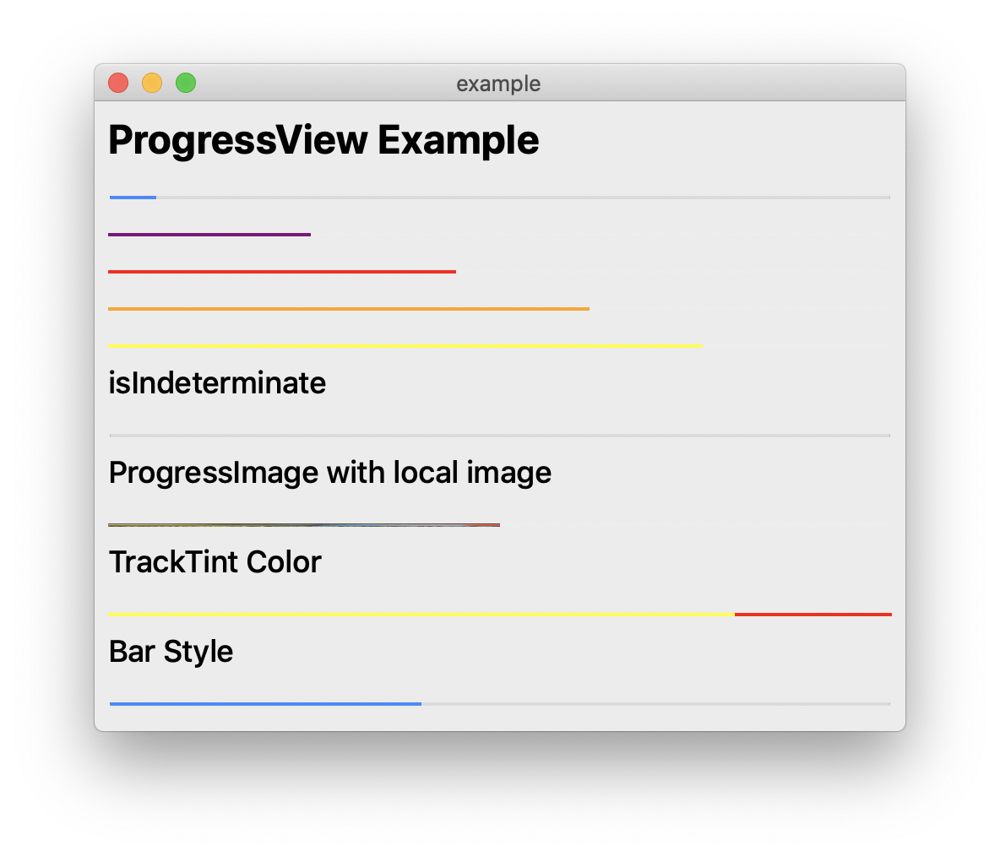
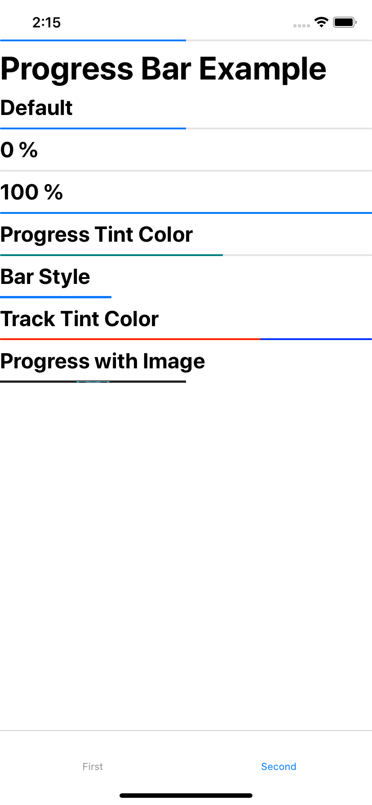
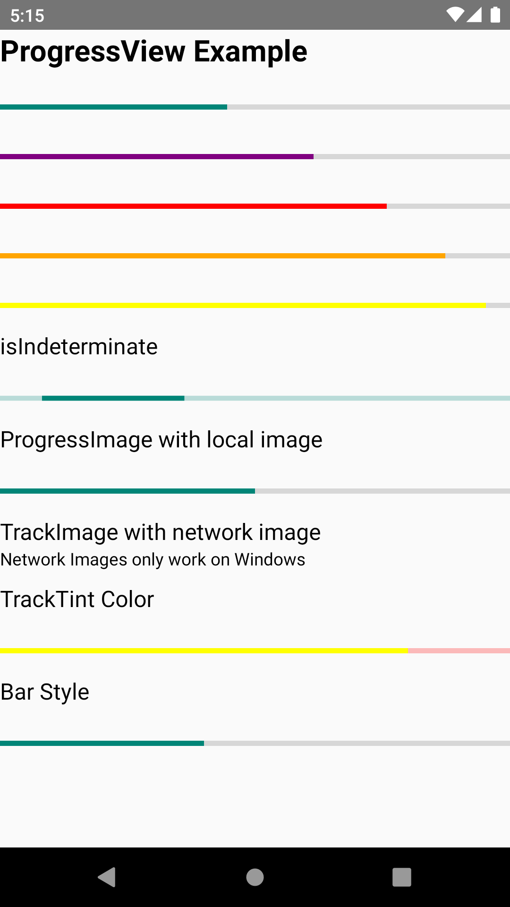
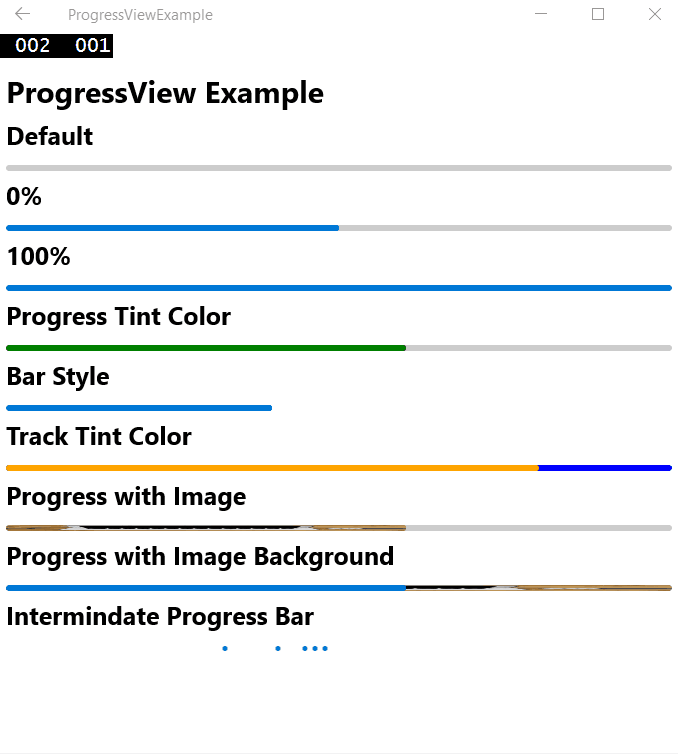

# ProgressView

Компонент **`ProgressView`** для macOS, iOS (на основе UIProgressView), Android и Windows.

=== "macOS"

    

=== "iOS"

    

=== "Android"

    

=== "Windows"

    

## Начало работы

```sh
npm install @react-native-community/progress-view --save
```

или

```sh
yarn add @react-native-community/progress-view
```

### Linking

**React Native 0.60+**

Пакет [автоматически связывается](https://github.com/react-native-community/cli/blob/master/docs/autolinking.md) при сборке приложения. Все, что вам нужно сделать, это:

```sh
npx pod-install
```

**React Native <= 0.59**

Выполните следующие команды

```sh
react-native link @react-native-community/progress-view
```

#### Windows

##### Добавьте проект `progress-view` в ваше решение.

1.  Откройте решение в Visual Studio 2019
2.  Щелкните правой кнопкой мыши значок Solution в Solution Explorer ➜ Add ➜ Existing Project.

    Выберите `node_modules\@react-native-community\progress-view\windows\progress-view\progress-view.vcxproj`.

##### **windows/myapp.sln**

Добавьте ссылку на `progress-view` в основной проект приложения. Из Visual Studio 2019:

Щелкните правой кнопкой мыши основной проект приложения ➜ Add ➜ Reference...
Отметьте `progress-view` из Solution Projects.

##### **pch.h**.

Добавьте `#include "winrt/progress_view.h"`.

##### **app.cpp**.

Добавьте `PackageProviders().Append(winrt::progress_view::ReactPackageProvider());` перед `InitializeComponent();`.

### Ручная установка

#### IOS

!!!note "Ручное связывание библиотеки - iOS"

    1.  В XCode в навигаторе проекта щелкните правой кнопкой мыши на `Libraries` ➜ `Add Files to [имя вашего проекта]`.
    2.  Перейдите в раздел `node_modules` ➜ `@react-native-community/progress-view` и добавьте `RNCProgressView.xcodeproj`.
    3.  В XCode в навигаторе проектов выберите свой проект. Добавьте `libRNCProgressView.a` в `Build Phases` вашего проекта ➜ `Link Binary With Libraries`.
    4.  Запустите проект (++cmd+r++)

## Использование

Импортируйте `ProgressView` из `@react-native-community/progress-view`

```js
import { ProgressView } from '@react-native-community/progress-view';
```

Добавьте `ProgressView` следующим образом

```js
<ProgressView
    progressTintColor="orange"
    trackTintColor="blue"
    progress={0.7}
/>
```

### Запуск примера приложения

#### Windows

1.  Клонируйте ветку
2.  Перейдите в `progress_view` и выполните команду `yarn install`.
3.  Запустите metro-сервер с помощью команды `yarn start:windows`.
4.  Откройте Visual Studios и откройте файл `example/windows/ProgressViewExample.sln`.
5.  Установите режим Debug x64 и запустите решение

#### IOS

1.  Клонировать ветку
2.  cd в `progress-view` и запустить `yarn install`.
3.  cd в `example/ios` и запустить `pod install`.
4.  cd обратно в `progress-view` и запустить `yarn ios`.

#### macOS

1.  Клонировать ветку
2.  cd в `progress-view` и запустить `yarn install`.
3.  cd в `example/macos/example/macos` и запустить `pod install`.
4.  Откройте только что созданное пространство `example.xcworkspace` в Xcode, выполните сборку и запустите

## Props

-   [Наследованные свойства `View`...](view.md#props)

### `progress`

Значение прогресса (от 0 до 1).

| type  | required |
| ----- | -------- |
| число | нет      |

### `progressImage`

Растягивающееся изображение для отображения в качестве индикатора выполнения.

| Тип                    | требуется |
| ---------------------- | --------- |
| Image.propTypes.source | No        |

### `progressTintColor`

Цвет оттенка самой полосы прогресса.

| Тип    | Требуется |
| ------ | --------- |
| string | No        |

### `progressViewStyle`

Стиль прогресс-бара. Сетевые изображения работают только под Windows.

| Type                   | Required |
| ---------------------- | -------- |
| enum('default', 'bar') | No       |

### `trackImage`

Растягивающееся изображение для отображения за индикатором выполнения. Сетевые изображения работают только под Windows.

| Type                   | Required |
| ---------------------- | -------- |
| Image.propTypes.source | No       |

### `trackTintColor`

Цвет оттенка дорожки индикатора выполнения.

| Тип    | Требуется |
| ------ | --------- |
| string | No        |

### `isIndeterminate`

Превращает индикатор выполнения в неопределенный индикатор выполнения.

| Type | Required | Platform |
| ---- | -------- | -------- |
| bool | No       | Windows  |

## Авторы

-   [Kaiden Sin](https://github.com/kdenz) - [Страстный создатель продуктов и кодер](http://linkedin.com/in/kaiden)
-   [Jesse Katsumata](https://github.com/Naturalclar)

## Лицензия

Библиотека выпускается под лицензией MIT.

## Ссылки

-   [@react-native-community/progress-view](https://github.com/react-native-progress-view/progress-view)
