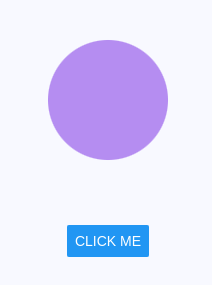

# Анимация стилей и свойств

В [последнем разделе](your-first-animation.md) мы узнали, как сделать простую анимацию, что такое общие значения и как их использовать. Теперь мы познакомимся с другим способом передачи стилей анимации компонентам. Мы также рассмотрим разницу между анимационными стилями и свойствами и то, как с ними работать с помощью `useAnimatedStyle` и `useAnimatedProps`.

## Анимация стилей

Как мы узнали в предыдущем разделе, мы можем анимировать стили, [передавая общие значения inline](glossary.md#animations-in-inline-styling) в свойство `style` элементов:

```js
function App() {
    const width = useSharedValue(100);

    return <Animated.View style={{ width }} />;
}
```

В базовых случаях этот синтаксис работает хорошо, но у него есть один большой недостаток. Он не позволяет получить доступ к значению, хранящемуся в общем значении. Например, невозможно построить более сложную анимацию, используя встроенный стайлинг, чтобы умножить это значение (или выполнить любую другую математическую операцию) перед присвоением его свойству `style`.

```js
<Animated.View style={{ width: width * 5 }} /> // this won't work
```

Предположим, что у нас есть пример с ящиком, который перемещается вправо при каждом нажатии кнопки:

```js
function App() {
    const translateX = useSharedValue(0);

    const handlePress = () => {
        translateX.value = withSpring(
            translateX.value + 50
        );
    };

    return (
        <View style={styles.container}>
            <Animated.View
                style={[
                    styles.box,
                    { transform: [{ translateX }] },
                ]}
            />
            <Button
                onPress={handlePress}
                title="Click me"
            />
        </View>
    );
}
```

Если мы хотим настроить изменение общего значения в зависимости от вводимых пользователем данных (например, умножение на 2 или выполнение другого математического уравнения), мы не можем использовать встроенную стилизацию.

К счастью, на помощь приходит хук `useAnimatedStyle`. Он предоставляет дополнительный контроль и гибкость над анимацией. Это может быть очень полезно при создании более сложных анимаций, включающих условные операторы или циклы.

Давайте посмотрим, как это работает:

```js
import React from 'react';
import { Button, View, StyleSheet } from 'react-native';
import Animated, {
    useSharedValue,
    withSpring,
    useAnimatedStyle,
} from 'react-native-reanimated';

export default function App() {
    const translateX = useSharedValue(0);

    const handlePress = () => {
        translateX.value += 50;
    };

    const animatedStyles = useAnimatedStyle(() => ({
        transform: [
            {
                translateX: withSpring(
                    translateX.value * 2
                ),
            },
        ],
    }));

    return (
        <>
            <Animated.View
                style={[styles.box, animatedStyles]}
            />
            <View style={styles.container}>
                <Button
                    onPress={handlePress}
                    title="Click me"
                />
            </View>
        </>
    );
}

const styles = StyleSheet.create({
    container: {
        flex: 1,
        alignItems: 'center',
        justifyContent: 'center',
    },
    box: {
        height: 120,
        width: 120,
        backgroundColor: '#b58df1',
        borderRadius: 20,
        marginVertical: 50,
    },
});
```

`useAnimatedStyle` позволяет получить доступ к значению, хранящемуся в общем значении. Благодаря этому мы можем умножить значение на `2`, прежде чем присвоить его `style`. Этот хук имеет еще одно преимущество перед передачей анимации в строчные стили. Он позволяет хранить всю логику, связанную с анимацией, в одном месте.

В действии его можно увидеть в примере ниже:

=== "AnimatingStyles.js"

    ```js
    import React from 'react';
    import { Button, View, StyleSheet } from 'react-native';
    import Animated, {
    	useSharedValue,
    	withSpring,
    	useAnimatedStyle,
    } from 'react-native-reanimated';

    export default function App() {
    	const translateX = useSharedValue(0);

    	const handlePress = () => {
    		translateX.value += 50;
    	};

    	// highlight-start
    	const animatedStyles = useAnimatedStyle(() => ({
    		transform: [
    			{
    				translateX: withSpring(
    					translateX.value * 2
    				),
    			},
    		],
    	}));
    	// highlight-end

    	return (
    		<>
    			{/* highlight-next-line */}
    			<Animated.View
    				style={[styles.box, animatedStyles]}
    			/>
    			<View style={styles.container}>
    				<Button
    					onPress={handlePress}
    					title="Click me"
    				/>
    			</View>
    		</>
    	);
    }

    const styles = StyleSheet.create({
    	container: {
    		flex: 1,
    		alignItems: 'center',
    		justifyContent: 'center',
    	},
    	box: {
    		height: 120,
    		width: 120,
    		backgroundColor: '#b58df1',
    		borderRadius: 20,
    		marginVertical: 50,
    	},
    });
    ```

=== "Результат"

    

## Анимация свойств

Большинство значений, которые разработчики анимируют (`width`, `color`, `transform` и т.д.), изменяются путем передачи их в качестве объекта в свойство `style` элемента. Но это не всегда так.

Иногда хочется анимировать не только стили, но и свойства, передаваемые компоненту.

Например, мы хотим анимировать элементы SVG. Вместо того чтобы передавать значения в свойство `style`, значения определяются как свойства:

```js
<Circle cx="50" cy="50" r="10" fill="blue" />
```

Reanimated поставляется всего с несколькими встроенными компонентами, такими как `Animated.View` или `Animated.ScrollView`. Для компонентов, не входящих в состав Reanimated, чтобы сделать их свойства анимируемыми, необходимо обернуть их с помощью [`createAnimatedComponent`](../core/createAnimatedComponent.md):

```js
import Animated from 'react-native-reanimated';
import { Circle } from 'react-native-svg';

const AnimatedCircle = Animated.createAnimatedComponent(
    Circle
);
```

Для анимирования радиуса окружности SVG мы можем просто передать общее значение в качестве свойства:

```js
function App() {
    const r = useSharedValue(10);

    return (
        <Svg>
            <AnimatedCircle
                cx="50"
                cy="50"
                r={r}
                fill="blue"
            />
        </Svg>
    );
}
```

Этот подход отлично работает, но, как и в случае с `useAnimatedStyle` для анимирования стилей, мы можем инкапсулировать логику анимации и получить доступ к свойству `.value` общего значения с помощью `useAnimatedProps`.

Так, если мы хотим плавно увеличивать радиус круга на `10px` при каждом нажатии кнопки, мы можем использовать `useAnimatedProps`:

```js
import React from 'react';
import { Button, View, StyleSheet } from 'react-native';
import Animated, {
    useSharedValue,
    useAnimatedProps,
    withTiming,
} from 'react-native-reanimated';
import { Svg, Circle } from 'react-native-svg';

const AnimatedCircle = Animated.createAnimatedComponent(
    Circle
);

export default function App() {
    const r = useSharedValue(20);

    const handlePress = () => {
        r.value += 10;
    };

    // highlight-start
    const animatedProps = useAnimatedProps(() => ({
        r: withTiming(r.value),
    }));
    // highlight-end

    return (
        <View style={styles.container}>
            <Svg style={styles.svg}>
                <AnimatedCircle
                    cx="50%"
                    cy="50%"
                    fill="#b58df1"
                    // highlight-next-line
                    animatedProps={animatedProps}
                />
            </Svg>
            <Button
                onPress={handlePress}
                title="Click me"
            />
        </View>
    );
}

const styles = StyleSheet.create({
    container: {
        flex: 1,
        alignItems: 'center',
    },
    svg: {
        height: 250,
        width: '100%',
    },
});
```

В функции, которую `useAnimatedProps` принимает в качестве аргумента, мы возвращаем объект со всеми свойствами, которые мы хотели бы анимировать. Затем мы можем передать значение, которое возвращает `useAnimatedProps`, в свойство `animatedProps` компонента Animated.

Ознакомьтесь с полным примером ниже:

=== "AnimatingProps.js"

    ```js
    import React from 'react';
    import { Button, View, StyleSheet } from 'react-native';
    import Animated, {
    	useSharedValue,
    	useAnimatedProps,
    	withTiming,
    } from 'react-native-reanimated';
    import { Svg, Circle } from 'react-native-svg';

    const AnimatedCircle = Animated.createAnimatedComponent(
    	Circle
    );

    export default function App() {
    	const r = useSharedValue(20);

    	const handlePress = () => {
    		r.value += 10;
    	};

    	// highlight-start
    	const animatedProps = useAnimatedProps(() => ({
    		r: withTiming(r.value),
    	}));
    	// highlight-end

    	return (
    		<View style={styles.container}>
    			<Svg style={styles.svg}>
    				<AnimatedCircle
    					cx="50%"
    					cy="50%"
    					fill="#b58df1"
    					// highlight-next-line
    					animatedProps={animatedProps}
    				/>
    			</Svg>
    			<Button
    				onPress={handlePress}
    				title="Click me"
    			/>
    		</View>
    	);
    }

    const styles = StyleSheet.create({
    	container: {
    		flex: 1,
    		alignItems: 'center',
    	},
    	svg: {
    		height: 250,
    		width: '100%',
    	},
    });
    ```

=== "Результат"

    

## Резюме

В этом разделе мы рассмотрели различия между анимацией стилей и свойств, а также то, как использовать `useAnimatedStyle` и `useAnimatedProps`. Подведем итоги:

-   Передача общих значений во встроенные стили - это простой способ создания анимации, но он имеет ряд ограничений.
-   Разница между анимацией `props` и `styles` заключается в том, что props передаются не в объект `style`, а как отдельные свойства компонента.
-   Используя `useAnimatedStyle` и `useAnimatedProps`, можно получить доступ к значению, хранящемуся в общем значении. Это позволяет получить дополнительный контроль над анимацией.
-   Вы можете создавать собственные анимируемые компоненты, обернув их с помощью `Animated.createAnimatedComponent`.

## Что дальше?

В [следующем разделе](customizing-animation.md) мы узнаем больше о функциях анимации и о том, как настраивать их поведение.

## Ссылки

-   [Animating styles and props](https://docs.swmansion.com/react-native-reanimated/docs/fundamentals/animating-styles-and-props/)
