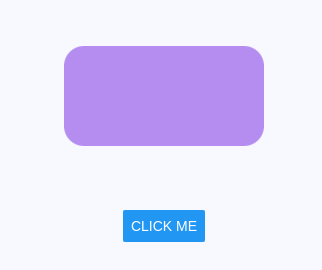

# Ваша первая анимация

В этом разделе мы познакомим вас с основными понятиями Reanimated. Если вы новичок в Reanimated, то вы попали в правильные руки! Мы начнем с создания простой анимации, которая поможет вам развить базовое понимание библиотеки. Затем, в следующих разделах, мы будем развивать эти знания и расширять ваши навыки. Поехали!

## Использование анимированного компонента

Начнем с того, что у нас должно быть что-то, что мы могли бы видеть на экране. Во-первых, для создания анимируемого компонента необходимо импортировать объект `Animated`:

```js
import Animated from 'react-native-reanimated';
```

Этот объект `Animated` оборачивает встроенные компоненты React Native, такие как `View`, `ScrollView` или `FlatList`.

Вы используете эти компоненты так же, как и любые другие JSX-компоненты:

```js
import Animated from 'react-native-reanimated';

export default function App() {
    return (
        <Animated.View
            style={{
                width: 100,
                height: 100,
                backgroundColor: 'violet',
            }}
        />
    );
}
```

!!!info ""

    Вы можете создавать свои собственные анимированные компоненты с помощью функции [`createAnimatedComponent`](../core/createAnimatedComponent.md).

## Определение общих значений

Общее значение [shared value](glossary.md#shared-value) - это движущий фактор всех ваших анимаций. Его можно рассматривать как состояние React, которое автоматически синхронизируется между "JavaScript" и "нативной" стороной вашего приложения (отсюда и название). Вы создаете общие значения с помощью хука `useSharedValue`:

```js
import { useSharedValue } from 'react-native-reanimated';
```

Как и любой другой [React хук](https://reactjs.org/docs/hooks-rules.html), его необходимо определить в теле компонента. В общем значении можно хранить любое JS-значение, например `number`, `string` или `boolean`, а также структуры данных, такие как `array` и `object`.

В качестве значения по умолчанию хука `useSharedValue` используем `100` и передадим возвращаемое значение в качестве встроенного стиля `Animated.View`:

```js
import Animated, {
    useSharedValue,
} from 'react-native-reanimated';

export default function App() {
    const width = useSharedValue(100);

    return (
        <Animated.View
            style={{
                width,
                height: 100,
                backgroundColor: 'violet',
            }}
        />
    );
}
```

## Использование общего значения

Давайте создадим очень простую анимацию, которая будет изменять `width` элемента. Мы заставим его увеличиваться на `50px` при каждом нажатии кнопки. Для этого мы можем модифицировать общее значение, связанное со свойством `width` компонента `Animated.View`. Я знаю, что это может показаться сложным, но на самом деле все очень просто.

Доступ к значениям, хранящимся в общих значениях, и их модификация осуществляются с помощью свойства `.value`.

Нет никакого сеттера или чего-то еще - вы просто изменяете свойство `.value`, как будто так и надо.

Определим функцию `handlePress`, внутри которой мы будем модифицировать общее значение:

```js
import { Button, View } from 'react-native';
import Animated, {
    useSharedValue,
} from 'react-native-reanimated';

export default function App() {
    const width = useSharedValue(100);

    const handlePress = () => {
        width.value = width.value + 50;
    };

    return (
        <View style={{ flex: 1, alignItems: 'center' }}>
            <Animated.View
                style={{
                    width,
                    height: 100,
                    backgroundColor: 'violet',
                }}
            />
            <Button
                onPress={handlePress}
                title="Click me"
            />
        </View>
    );
}
```

Пожалуйста, задержитесь на секунду, чтобы сократить `width.value = width.value + 50` до `width.value += 50`. Мы готовим этот код к последнему шагу, который наконец-то оживит нашу анимацию!

!!!warning ""

    Распространенной ошибкой является прямое изменение общего значения, например, так: ~~`sv = sv + 100;`~~. Всегда помните, что для доступа к общему значению следует использовать свойство `.value`. Здесь правильным будет использование свойства `sv.value = sv.value + 100;`.

## Использование функции анимации

Наконец, импортируем функцию `withSpring` и оборачиваем вокруг `width.value + 50` в функции `handlePress` так, чтобы значение, которое возвращает `withSpring`, изменяло общее значение. Это создаст пружинящую анимацию, которая переводит ширину элемента из текущего значения (здесь `width.value`) в новое (здесь `width.value + 50`).

```js
import { Button, View } from 'react-native';
import Animated, {
    useSharedValue,
    withSpring,
} from 'react-native-reanimated';

export default function App() {
    const width = useSharedValue(100);

    const handlePress = () => {
        width.value = withSpring(width.value + 50);
    };

    return (
        <View style={{ flex: 1, alignItems: 'center' }}>
            <Animated.View
                style={{
                    width,
                    height: 100,
                    backgroundColor: 'violet',
                }}
            />
            <Button
                onPress={handlePress}
                title="Click me"
            />
        </View>
    );
}
```

И вуаля, мы сделали нашу первую анимацию с помощью Reanimated! Как это работает в полной мере, вы можете увидеть в превью ниже:

=== "FirstAnimation.js"

    ```js
    import React from 'react';
    import { Button, StyleSheet, View } from 'react-native';
    import Animated, {
    	useSharedValue,
    	withSpring,
    } from 'react-native-reanimated';

    export default function App() {
    	const width = useSharedValue(100);

    	const handlePress = () => {
    		width.value = withSpring(width.value + 50);
    	};

    	return (
    		<View style={styles.container}>
    			<Animated.View
    				style={{ ...styles.box, width }}
    			/>
    			<Button
    				onPress={handlePress}
    				title="Click me"
    			/>
    		</View>
    	);
    }

    const styles = StyleSheet.create({
    	container: {
    		flex: 1,
    		alignItems: 'center',
    	},
    	box: {
    		height: 100,
    		backgroundColor: '#b58df1',
    		borderRadius: 20,
    		marginVertical: 64,
    	},
    });
    ```

=== "Результат"

    

## Резюме

В этом разделе мы познакомились с основами Reanimated. Мы узнали о компонентах `Animated`, общих значениях и о том, как использовать их для создания простой анимации. Подведем итоги:

-   Компоненты `Animated` используются для определения анимируемых элементов.
-   Общие значения являются движущим фактором всех анимаций, и мы определяем их с помощью хука `useSharedValue`.
-   Доступ к общим значениям и их модификация всегда осуществляются через свойство `.value` (например, `sv.value = 100;`).
-   Для создания плавной анимации модифицируйте общие значения с помощью анимационных функций типа `withTiming`.

## Что дальше?

В [следующем разделе](animating-styles-and-props.md) мы узнаем, как анимировать стили и свойства с помощью хуков `useAnimatedStyle` и `useAnimatedProps`.

## Ссылки

-   [Your First Animation](https://docs.swmansion.com/react-native-reanimated/docs/fundamentals/your-first-animation/)
